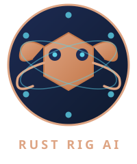

<div align="center">
  
  <br/>
  <h1>Rust Rig AI</h1>

  [](LICENSE)
  [](https://daniel-dos.github.io/rust-ollama-chat/)
</div>

Aplicação desktop em Rust com interface gráfica (Iced) que integra Ollama (LLM local) com busca web via MCP server e upload para S3.

**Funcionalidades:**

- Chat com LLM local via Ollama
- Busca web automatica (web_search + web_fetch) via MCP
- Suporte a URL direta ou pergunta livre
- Upload de respostas para S3 (floci mock ou AWS real)

---

## Pre-requisitos

- **Rust** (edition 2024) -- `rustup update`
- **Python 3.11+** -- `python3 --version`
- **Docker** (opcional, para S3 local) -- `docker --version`
- **Ollama** rodando localmente -- `ollama --version`

---

## Quick Start

1. Clone o repositorio e entre no diretorio:

   ```bash
   git clone <url> && cd Rust-Rig-AI
   ```

2. Instale as dependencias Python do servidor MCP:

   ```bash
   pip install -r mcp/requirements.txt
   ```

3. (Opcional) Suba o mock S3 local com floci:

   ```bash
   docker compose up -d floci
   ```

4. Exporte as variaveis de ambiente obrigatorias:

   ```bash
   export OLLAMA_MODEL=gemma2:9b
   export OLLAMA_API_KEY=<sua-key>
   ```

5. Execute a aplicacao:

   ```bash
   cargo run
   ```

   ⚠️ A aplicacao abre uma **janela grafica** (nao e mais um programa puramente CLI).
   A janela exibe um splash de 5s e em seguida o chat com campo de texto e botao "Enviar".

---

## Variaveis de Ambiente

| Variavel | Obrigatoria | Descricao |
|----------|-------------|-----------|
| `OLLAMA_MODEL` | Sim | Nome do modelo Ollama (ex: `gemma2:9b`, `llama3.2`) |
| `OLLAMA_API_KEY` | Sim | API key para busca web (usada pelo servidor Python MCP) |
| `RUST_LOG` | Nao | Filtro de logging tracing (default: `warn,Rust_Rig_AI=info`) |
| `AWS_*` | Nao | Credenciais AWS padrao; fallback `us-east-1`; para floci use `AWS_ENDPOINT_URL=http://localhost:4566` |

---

## Arquitetura

```
src/main.rs (fn main — sem #[tokio::main])
  ├── tokio::runtime::Runtime::new() + rt.enter()
  ├── McpClientManager::init()     → sobe Python MCP server uma vez (via rt.block_on)
  ├── banner_text::print_banner()
  ├── println!("Iniciando interface gráfica...")
  ├── std::thread::sleep(3s)       ← delay terminal antes da janela
  ├── gui::app::run(&mcp_manager)  ← janela Iced
  │     ├── Splash 5s com barra de progresso animada (█░)
  │     ├── text_input + button "Enviar"
  │     ├── mostra "Processando..." durante espera
  │     ├── Task::perform(resposta_chat_peer(peer, prompt), ...)
  │     └── devolve resposta para main quando fecha
  ├── mcp_manager.shutdown()
  └── s3::get_my_bucket() + upload_bucket()
```

### Fluxo de decisao URL vs busca

- Usa `extrair_url(prompt)` com regex `https?://[a-zA-Z0-9./?=_%:&#-]+`
- Se extrair URL -> `fetch_url(peer, url)` (fetch direto)
- Se nao -> `search_and_fetch(peer, query)` (busca + extrai primeira URL + fetch)
- **Nao** usar `contains("http")` -- causa falsos positivos

### Stack tecnologica

| Componente | Versao | Descricao |
|------------|--------|-----------|
| rig-core | 0.39.0 | Framework de agentes IA, integracao Ollama |
| rmcp | 1.8.0 | Cliente MCP (Model Context Protocol) |
| tokio | 1.52.3 | Runtime assincrono |
| aws-sdk-s3 | 1.137.0 | Upload S3 |
| regex | 1.12.4 | Extracao de URLs |
| iced | 0.13 (feature `tokio`) | Interface grafica desktop |
| Python | mcp>=1.0.0, ollama>=0.4.0, rich>=13.0.0 | Servidor MCP |

---

## Comandos

| Comando | Descricao |
|---------|-----------|
| `cargo build` | Compilar o binario |
| `cargo clippy --all-targets --all-features --locked -- -D warnings` | Lint estrito |
| `cargo test` | Executar testes |
| `cargo run` | Executar a aplicacao |

Nota: Nao ha `rustfmt.toml`, `justfile`, `Makefile` ou scripts npm.

---

## MCP Server (Python)

- Servidor em `mcp/web-search-mcp.py` e spawnado automaticamente pelo `McpClientManager::init()`
- Expoe duas tools: `web_search(query, max_results)` e `web_fetch(url)`
- Requer `pip install -r mcp/requirements.txt`
- Sem hot-reload -- reinicie a aplicacao se editar o Python
- Nota: `rich` esta no requirements.txt mas nao e usado no codigo (info para contribuidores)

---

## S3 com floci

- `docker compose up -d floci` sobe mock S3 local na porta 4566
- O programa usa o **primeiro bucket** encontrado na conta
- Nomes de arquivo sao aleatorios (10 letras alfabeticas) com extensao `.md`
- Para AWS real, configurar credenciais padrao (`AWS_ACCESS_KEY_ID`, etc.)

---

## Codigo Legado (`#[allow(dead_code)]`)

As seguintes funcoes/structs estao marcadas com `#[allow(dead_code)]` para backward compatibility. **Nao remover** sem verificar dependencias externas:

- `MCPTools`, `tools_list()`, `mcp_client_tools()` em `mcp/web_search_mcp.rs`
- `search_web()` em `rig/web_search.rs`

---

## Erros Comuns

| Erro | Causa | Solucao |
|------|-------|---------|
| `OLLAMA_MODEL` nao definida | Env var ausente | `export OLLAMA_MODEL=gemma2:9b` |
| Busca web falha silenciosamente | `OLLAMA_API_KEY` nao definida | `export OLLAMA_API_KEY=<sua-key>` |
| MCP nao sobe | Python ou dependencias ausentes | `pip install -r mcp/requirements.txt` |
| S3 falha | floci nao esta rodando | `docker compose up -d floci` |

---

## Nota sobre Cargo.lock

O `Cargo.lock` e **versionado** neste repositorio (diferente de alguns templates Rust que o ignoram). Isso garante builds reproduziveis.

---

## Licenca

MIT (c) 2026 Daniel Dias
